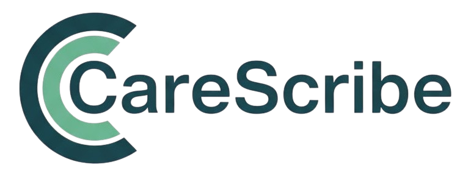

<h1> </h1>

An AI-powered healthcare documentation system built to modernize and simplify clinical workflows.

---

## Overview

CareScribe transforms complex patient interactions into structured, actionable medical records.  
The system identifies appointment context, processes live audio and uploaded transcripts, and produces clear summaries, tasks, follow-up items, and historical record entries.

CareScribe is designed to support a broad range of users including multilingual patients, caregivers, and individuals who struggle with fragmented medical information.

---

## Frontend

**Framework and Core Tools**  
- React 19  
- TypeScript  
- Vite  
---

## AI & External Integrations

**Generative AI**  
- Google Gemini for medical summarization, task extraction, and contextual insights  

**Audio Processing**  
- ElevenLabs for high-quality speech synthesis  

---

# Key Features

## Live Recording and Transcription
Record patient consultations in real time.  
Captured audio is transcribed and processed into meaningful medical content.

## AI-Powered Summaries
Automatically generates structured notes including:  
- Symptoms  
- Diagnoses  
- Assessment details  
- Medications  
- Labs or imaging  
- Follow-up actions  
- Lifestyle or treatment recommendations  
- Task lists

## Unified Patient History and Document Hub
A consolidated health record containing:  
- Past appointments  
- Transcripts  
- Summaries  
- Medications  
- Uploaded documents  
- Follow-up tasks  
- Organized timelines  

Searchable by:  
- Doctor  
- Type of appointment  
- Reason for visit  
- Date  
- Medication  

## Appointment Management
- Integrated calendar  
- Visit timelines  
- Automatically generated follow-ups, tasks, and reminders  
- Manual or automated appointment creation  

## PDF Report Generation
Generate PDFs for:  
- Full transcripts  
- AI summaries  
- Visit overviews  
- Medication instructions  
- Follow-up plans  

## Dashboard and Analytics
Interactive visualizations for:  
- Appointment trends  
- Patient activity  
- Document usage  
- Treatment adherence patterns  

---

# Future Roadmap

Planned enhancements inspired by the official CareScribe product roadmap (PDF page 9):

- Mandatory consent controls for both patients and clinicians  
- On-device AI inference for handling sensitive clinical data  
- Encrypted, secure clinician messaging within the application  

---

# Setup and Installation

## Prerequisites
- Node.js v20+  
- npm  
- PostgreSQL (Neon recommended)

---

## 1. Clone the repository

```bash
git clone <repo-url>
cd CareScribe
```

### 2. Install dependencies
```bash
cd frontend
npm install
```

### 3. Configure environment variables

```bash
DATABASE_URL=postgres://your_connection_string
GEMINI_API_KEY=your_google_api_key
ELEVENLABS_API_KEY=your_elevenlabs_key
SESSION_SECRET=your_secret_key
```

Add the .env file with your database and API credentials.

### 4. Initialize the database
```bash
npm run db:push
```

### 5. Start the development server
```bash
npm run dev
```

### 6. Access the application
Open your browser and navigate to http://localhost:3000


